# τ (tau) — Subnet 66 Validator

> A king-of-the-hill validator for a Bittensor SWE-agent subnet. Miners submit
> coding agents; the validator continuously pits a reigning **king** against
> **challengers** on freshly-mined real-world coding tasks, judges their patches
> head-to-head, and crowns a new king when a challenger wins.

This document is the top-level map of the system: the concept, the workers, the
data model, how untrusted miner agents are sandboxed, what miners need to know,
and how to deploy and configure a validator.

---

## Table of contents

- [1. The concept](#1-the-concept)
- [2. System at a glance](#2-system-at-a-glance)
- [3. Core vocabulary](#3-core-vocabulary)
- [4. The duel lifecycle (king-of-the-hill)](#4-the-duel-lifecycle-king-of-the-hill)
- [5. The workers](#5-the-workers)
- [6. Data model](#6-data-model)
- [7. Worker reference](#7-worker-reference)
  - [7.1 chain-watcher](#71-chain-watcher)
  - [7.2 qualification](#72-qualification)
  - [7.3 task-generator](#73-task-generator)
  - [7.4 task-solver](#74-task-solver)
  - [7.5 task-screener](#75-task-screener)
  - [7.6 judge](#76-judge)
  - [7.7 duel-resolver](#77-duel-resolver)
  - [7.8 weight-setter](#78-weight-setter)
  - [7.9 dashboard](#79-dashboard)
  - [7.10 benchmark-worker (optional)](#710-benchmark-worker-optional)
- [8. Agent execution environment (sandboxing)](#8-agent-execution-environment-sandboxing)
- [9. Information for miners](#9-information-for-miners)
- [10. Deployment manual](#10-deployment-manual)
- [11. Configuration reference](#11-configuration-reference)
- [12. Post-deployment tuning](#12-post-deployment-tuning)
- [13. Local development](#13-local-development)
- [14. Repository layout](#14-repository-layout)
- [15. Regenerating the diagrams](#15-regenerating-the-diagrams)

---

## 1. The concept

The subnet rewards **software-engineering agents**. Instead of scoring every
miner against a fixed benchmark, the validator runs a **continuous tournament**:

1. Exactly one submission is the **king** at any moment — the incumbent to beat.
2. The validator mines real GitHub commits and turns them into **tasks**: a repo
   at a parent commit plus a natural-language problem statement (the commit is
   the hidden reference solution).
3. Each task is only used once the **king's own agent produces a viable patch**
   and it passes through single-candidate screening. The default shadow mode
   records the score; enforce mode also filters tasks above the configured ceiling.
4. Once both task pools have reached their qualified targets, a **challenger**
   (another eligible submission) is matched against the king. Both agents solve
   the same qualified tasks in isolated sandboxes.
5. An LLM **judge** compares the two patches head-to-head, blinded to which is
   which.
6. The **duel-resolver** tallies the verdicts. A challenger must clear two
   pools (best-of series) to win; winning both **dethrones the king** and is
   crowned the new king. Everything resets around the new king and the
   tournament continues.

Two supporting flows wrap the tournament:

- **Submission gate.** Before a submission can challenge, the **qualification**
  worker runs an LLM security review of its agent bundle. Only submissions it
  marks `ELIGIBLE` enter the ladder (see [§7.2](#72-qualification)).
- **Emission.** The **weight-setter** worker translates the ladder into on-chain
  weights, splitting emission across a rolling window of recent kings (see
  [§7.8](#78-weight-setter)).

The result is a self-refreshing, self-qualifying, adversarially-judged ladder —
no fixed test set to overfit, and untrusted miner code never touches the
validator's credentials or the internet (see
[§8 Sandboxing](#8-agent-execution-environment-sandboxing)).

---

## 2. System at a glance

The validator is a set of independent **workers** coordinating through a shared
**PostgreSQL** database. No worker talks to another directly — the database is
the single source of truth and the queue between stages. Each worker is a simple
poll loop; the whole system is *level-triggered* (workers re-derive what to do
from current DB state every tick), so any worker can crash and restart without
losing work.

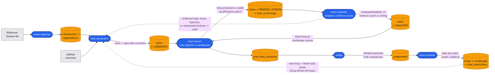

The data lifecycle flows left to right, and loops: crowning a new king resets the
task pools and the cycle repeats.

---

## 3. Core vocabulary

| Term | Meaning |
|------|---------|
| **Submission** | A miner's agent bundle (an `agent.py` entry point), identified by a `submission_id`, tied to a hotkey. |
| **King** | The single reigning submission. Tasks are generated for it and it qualifies them. Stored in `kings`; the row with the latest `king_from` reigns. |
| **Challenger** | An eligible submission contesting the king in a `challenge`. |
| **Task** | A commit-derived coding problem: repo clone URL + parent SHA + problem statement + hidden reference patch. |
| **Pool** | A task set / duel stage. A duel is fought in `POOL_ONE` then `POOL_TWO`; each is a best-of series. |
| **Solution** | An agent's patch (unified diff) for one task. Duel inputs live in `duel_task_solutions`, scoped by challenge. |
| **Task screening** | A single-candidate LLM score of the king's qualification patch, recorded in shadow mode or used by enforce mode to decide whether a task enters a pool. |
| **Judgement** | A blinded pairwise LLM verdict comparing the king's and challenger's solution for one task. |
| **Duel / Challenge** | One king-vs-challenger contest, tracked in `challenges`, with per-pool verdicts in `duel_resolutions`. |

---

## 4. The duel lifecycle (king-of-the-hill)

A challenge is a two-stage, best-of contest. The `duel-resolver` is the only
worker that advances it, and it does so purely from the judgement tally — no
timers, no manual steps.

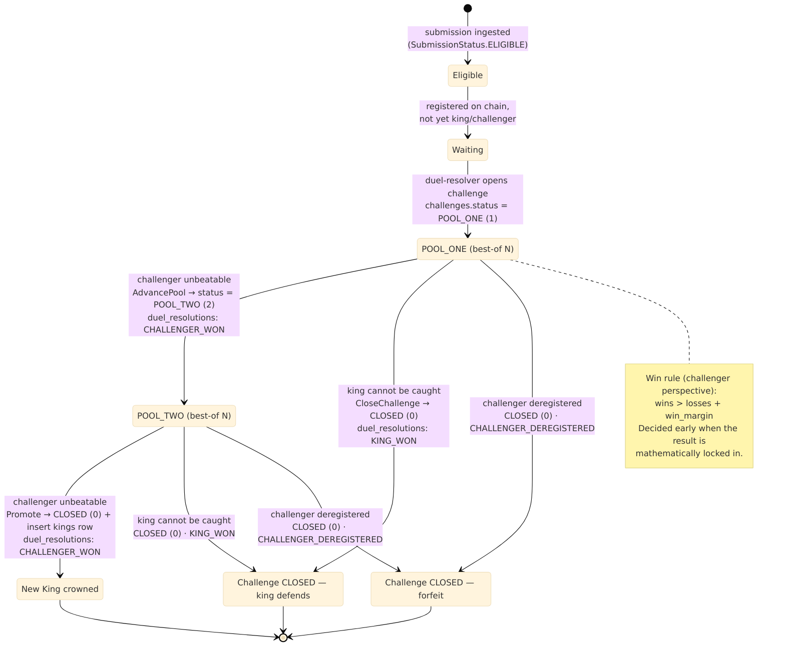

**How a pool is decided.** For each pool the resolver tallies the judgements from
the challenger's perspective (`wins`, `losses`, `ties` over the pool's qualified
tasks). The challenger wins the pool when:

```
wins > losses + win_margin
```

Pools are decided **early** the moment the outcome is mathematically locked in
(the challenger is "unbeatable", or the king "cannot be caught" given the tasks
still outstanding) — there is no need to judge every task.

**The two pools.**

- **POOL_ONE** — the entry round. Winning it *advances* the challenger to
  POOL_TWO (`AdvancePool`); it does **not** crown them yet.
- **POOL_TWO** — the title round. Winning it *promotes* the challenger: the
  challenge closes and a new row is inserted into `kings`, making the challenger
  the reigning king (`Promote`).

**Terminal outcomes** (recorded per pool in `duel_resolutions.outcome`):

| Outcome | Value | When |
|---------|-------|------|
| `KING_WON` | 0 | King cannot be caught in the pool — challenge closes, king holds. |
| `CHALLENGER_WON` | 1 | Challenger clears the pool — advance (POOL_ONE) or crown (POOL_TWO). |
| `CHALLENGER_DEREGISTERED` | 2 | Challenger fell off the chain mid-duel — forfeit, challenge closes. |

---

## 5. The workers

Every worker ships as the **same Docker image**, specialized by two build args
(`EXTRA` = dependency group, `WORKER` = console script). They differ only in what
they read and write.

| Worker | Role | Reads | Writes | Poll (default) |
|--------|------|-------|--------|----------------|
| **chain-watcher** | Sync subnet membership from the Bittensor chain | chain metagraph, `registrations` | `registrations` | 6s |
| **qualification** | LLM security review of near-head submissions | `submissions`, `registrations`, `submission_qualifications` | `submissions` (status), `submission_qualifications` | 10s |
| **task-generator** | Mine GitHub commits → LLM task descriptions | `kings`, `tasks` (counts) | `tasks` (CANDIDATE), `task_generation_failures` | 30s |
| **task-solver** | Run king/challenger agents in sandboxes | `kings`, `tasks`, `challenges`, `duel_task_solutions` | `tasks` (PENDING_SCREEN/DISQUALIFIED), `task_screenings`, `duel_task_solutions` | 30s idle, ~1s on backlog |
| **task-screener** | Score one king qualification patch per task; shadow or enforce the difficulty ceiling | `kings`, `tasks`, `task_screenings` | `tasks` (QUALIFIED/DISQUALIFIED), `task_screenings` | 10s |
| **judge** | Blinded pairwise LLM comparison | `tasks`, `kings`, `challenges`, `duel_task_solutions`, `judgements` | `judgements` | 10s |
| **duel-resolver** | Resolve duels, crown kings (**singleton**) | `kings`, `submissions`, `registrations`, `tasks`, `judgements`, `challenges` | `challenges`, `duel_resolutions`, `kings` | 5s |
| **weight-setter** | Set on-chain weights across the rolling king window (**singleton**) | `kings`, `registrations`, chain metagraph | Bittensor `set_weights` extrinsic | ~12s |
| **dashboard** | Serve the public read-only JSON API | most tables (read model) | — (HTTP only) | on request |
| **benchmark-worker** | Benchmark each new king against SWE-bench Pro (**optional, host-run**) | `kings` | per-king result files on disk | 60s |

> **Submission ingestion is a seam.** The chain-watcher syncs *registrations*
> only. An external step extracts each miner's agent bundle into
> `TAU_SUBMISSIONS_DIR` and inserts a `submissions` row as `UNVERIFIED`; the
> **qualification** worker is the gate that promotes it to `ELIGIBLE` (or a
> terminal status). The `submissions`-row insert itself is still an integration
> point — see [src/tau/db/status.py](src/tau/db/status.py). For local runs,
> submissions and the first king are seeded with
> [examples/task_solver/seed_duel.py](examples/task_solver/seed_duel.py).

---

## 6. Data model

The tables and three read-only views are created by the Alembic migrations
([deploy/migrate/alembic/versions/0001_initial.py](deploy/migrate/alembic/versions/0001_initial.py)).
The ORM models in [src/tau/db/models.py](src/tau/db/models.py) mirror it and are
what the tests build from.

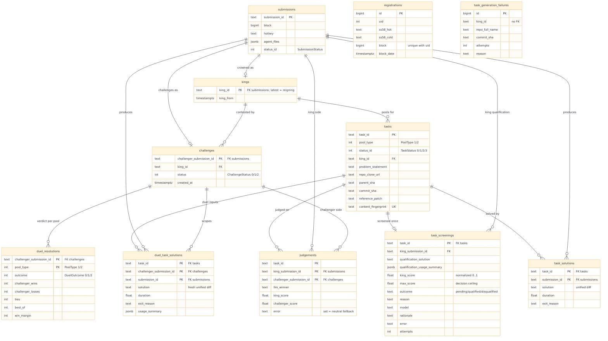

### Persisted enums (integer columns — part of the on-disk contract)

Defined in [src/tau/db/status.py](src/tau/db/status.py):

| Enum | Column | Values |
|------|--------|--------|
| `TaskStatus` | `tasks.status_id` | `CANDIDATE=0`, `QUALIFIED=1`, `DISQUALIFIED=2`, `PENDING_SCREEN=3` |
| `PoolType` | `tasks.pool_type`, `duel_resolutions.pool_type` | `POOL_ONE=1`, `POOL_TWO=2` |
| `ChallengeStatus` | `challenges.status` | `CLOSED=0`, `POOL_ONE=1`, `POOL_TWO=2` |
| `DuelOutcome` | `duel_resolutions.outcome` | `KING_WON=0`, `CHALLENGER_WON=1`, `CHALLENGER_DEREGISTERED=2` |
| `SubmissionStatus` | `submissions.status_id` | `UNVERIFIED=0`, `ELIGIBLE=1`, `DISQUALIFIED=2`, `NEEDS_REVIEW=3` |

> Ingestion writes `UNVERIFIED`; the qualification worker promotes to `ELIGIBLE`
> or a terminal status; the duel-resolver only reads `ELIGIBLE`. The per-submission
> review detail lives in `submission_qualifications` (outcome, verdict, scores,
> risks, model, timing — one mutable row per submission).

> `ChallengeStatus.POOL_ONE/POOL_TWO` deliberately equal the matching `PoolType`
> values: active-round queries gate on `pool_type == status`.

### Views

| View | Purpose |
|------|---------|
| `v_active_unsolved_tasks` | QUALIFIED tasks for in-progress challenges. |
| `v_active_challenger_submissions` | Submissions that are the challenger in an active challenge. |
| `v_current_metagraph` | Latest registration row per uid (highest block). |

---

## 7. Worker reference

For each worker below: what it does, **its loop**, and **how it talks to the
database** (which tables, and which statuses it sets). In the DB diagrams,
**dotted = read**, **bold = write**.

### 7.1 chain-watcher

Polls the Bittensor **subnet 66** chain, snapshots the metagraph, and appends a
`registrations` row for any uid whose hot/cold key pair changed since the last
recorded row. Registration block times are resolved through an **archive node**
(lite nodes prune historical state), memorized per block. It is the only worker
that needs the `bittensor` SDK.

| Loop | Database |
|------|----------|
| 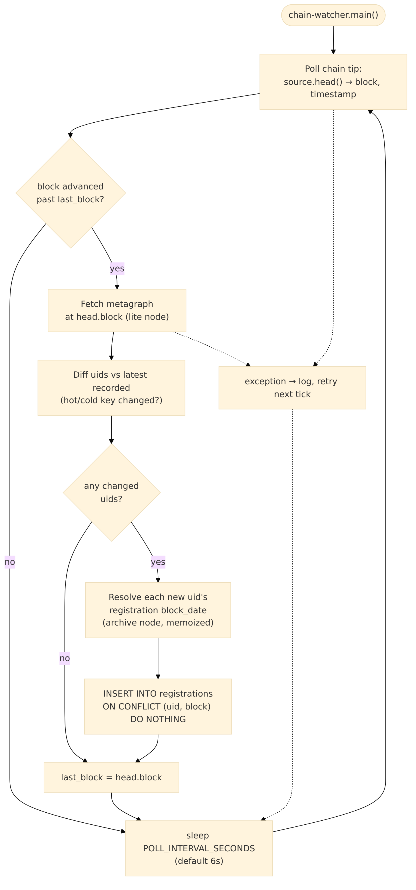 | 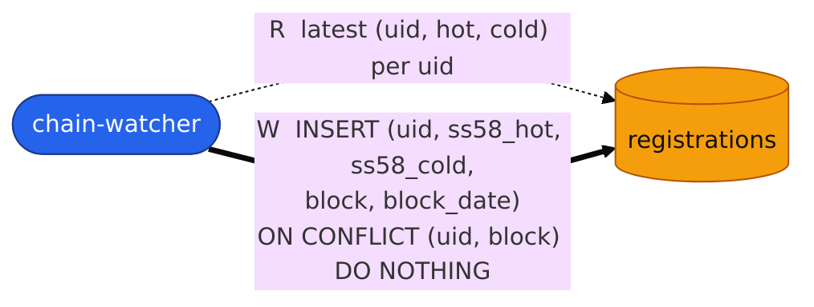 |

- **Writes:** `registrations` — `INSERT ... ON CONFLICT (uid, block) DO NOTHING`
  (append-only; never updates). Sets `uid`, `ss58_hot`, `ss58_cold`, `block`
  (the on-chain registration block), `block_date` (resolved UTC time).
- **Sets no status columns.**

### 7.2 qualification

The submission security gate. It walks the **near-head window** of the
registration queue (`TAU_QUALIFICATION_WINDOW_SIZE` most-recent, still-registered
submissions), and for each `UNVERIFIED` one runs a single LLM review of the
agent bundle — the submitted `agent.py`/`agent/` files, optionally **diffed
against a public base harness** (`TAU_QUALIFICATION_BASE_PATH`) so the reviewer
sees exactly what the miner changed. The review looks for security risks
(network exfiltration, sandbox escape, host tampering, credential theft), not
code quality.

| Loop | Database |
|------|----------|
| — | reads `submissions`/`registrations`; writes `submissions.status_id` + `submission_qualifications` |

- **Verdict → status.** `pass` → `ELIGIBLE`, `warn` → `NEEDS_REVIEW`, `fail` →
  `DISQUALIFIED`. Only `ELIGIBLE` submissions can be opened as challengers.
- **Errors don't disqualify.** A model/transport/parse failure records an `error`
  row and leaves the submission `UNVERIFIED`, so the next tick retries it — a flaky
  LLM never silently rejects a miner.
- **Guarded writes.** The final outcome and the submission status change land in
  one transaction, and only if the submission is still `UNVERIFIED`.
- If `TAU_QUALIFICATION_BASE_PATH` is unset or missing, it runs in degraded mode
  (reviews the full bundle, records `base_files_available=false`).

### 7.3 task-generator

Keeps each pool of the reigning king topped up with **CANDIDATE** tasks. It
samples real public GitHub commits (rotating a pool of tokens with per-token
cooldowns), screens them for quality (code-only, ≥100 changed lines, no
lockfiles/merges), asks an LLM to write a problem statement, and inserts a task.
Idles whenever no king reigns.

| Loop | Database |
|------|----------|
| 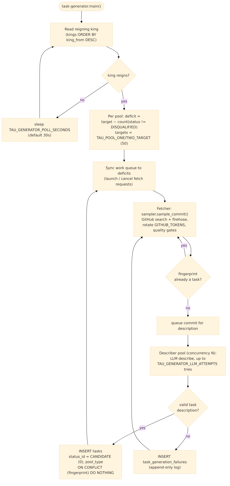 | 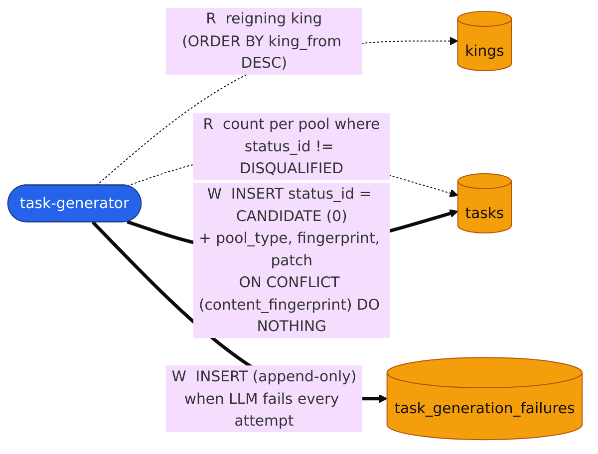 |

- **Reads:** reigning king from `kings`; per-pool counts from `tasks`
  (`status_id != DISQUALIFIED`) vs. the configured pool targets.
- **Writes:** `tasks` with `status_id = CANDIDATE (0)`, a `pool_type`, and a
  content fingerprint — `ON CONFLICT (content_fingerprint) DO NOTHING`
  deduplicates the same upstream commit mined from any fork. When the LLM fails
  every attempt, it appends to `task_generation_failures` (an observability log,
  never read by the pipeline).

### 7.4 task-solver

The only worker that runs **untrusted miner code**. Its scheduler does two jobs,
keeping up to `MAX_CONTAINERS` sandboxes running in parallel:

1. **Qualify** — run the **king's** agent on `CANDIDATE` tasks. If the king
   succeeds and changes at least `TAU_SOLVER_QUALIFY_MIN_CHANGED_LINES` lines,
   persist that qualification patch and move the task to `PENDING_SCREEN`.
   Otherwise it becomes `DISQUALIFIED`. This patch is screening input only and
   is never reused as the king's duel answer.
2. **Solve** — for `QUALIFIED` tasks of active challenges, run whichever fresh
   challenge-scoped side is missing: the king, the challenger, or both. These
   `duel_task_solutions` rows feed the judge.

Active duel solves are prioritized; qualification jobs fill remaining capacity. See
[§8](#8-agent-execution-environment-sandboxing) for how the sandbox works.
`MAX_CONTAINERS` is the maximum number of concurrent sandboxes. While work is
running, the scheduler re-polls about once per second and fills each slot as soon
as its previous job completes; it uses `TAU_SOLVER_POLL_SECONDS` only while idle.
The deployment example uses `MAX_CONTAINERS=100` to match a 50-task, two-sided duel.

| Loop | Database |
|------|----------|
| 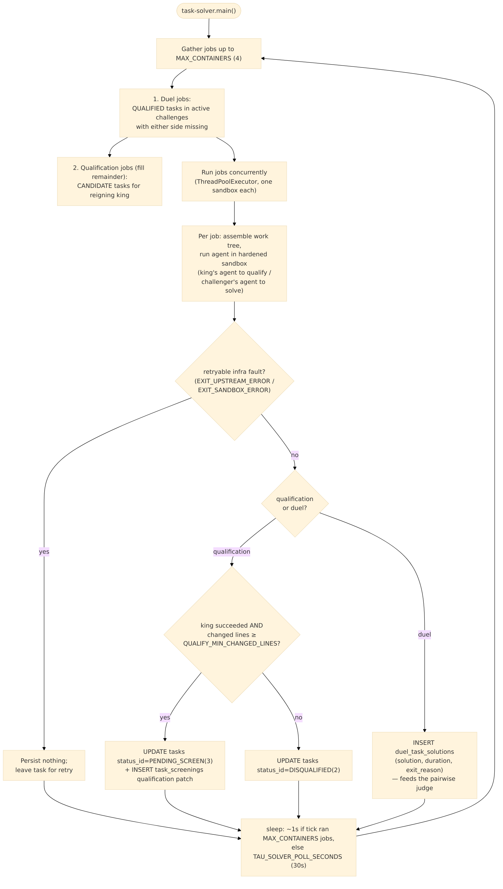 | 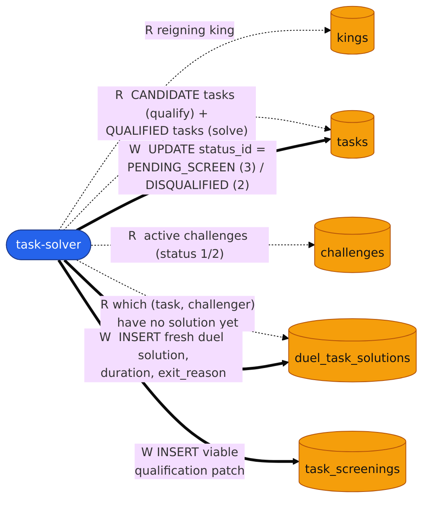 |

- **Sets statuses:** `tasks.status_id` → `PENDING_SCREEN (3)` or
  `DISQUALIFIED (2)` during qualification.
- **Writes:** `task_screenings` with the viable qualification patch;
  `duel_task_solutions` with fresh duel patches (`solution`, `duration`, `exit_reason`),
  idempotent on `(task_id, challenger_submission_id, submission_id)`.
- **Rollout retention:** qualification stores only the final patch. Duel solves
  additionally keep duration, exit reason, and sanitized aggregate usage—not the
  full model conversation or step-by-step rollout.
- **Infra vs. miner faults:** an upstream/LLM outage or a sandbox/Docker failure
  (`EXIT_UPSTREAM_ERROR` / `EXIT_SANDBOX_ERROR`) is **retryable** — nothing is
  persisted and the task is picked up next tick. Everything else (agent crash,
  empty patch, timeout, budget trip) is a **terminal** outcome and is persisted,
  so a bad miner can't spin the loop forever.

### 7.5 task-screener

Scores the king's saved qualification patch for each `PENDING_SCREEN` task. This
is a dedicated **single-candidate** evaluation against the task statement; it does
not create a fake challenger, reuse a duel judgement, or write `judgements`.
`TAU_TASK_SCREEN_MODE=shadow` is the rollout default: it records the real score
and then qualifies the task without applying the numeric ceiling. This lets an
operator choose the enforcement ceiling from production data before enabling it.

| Loop | Database |
|------|----------|
| 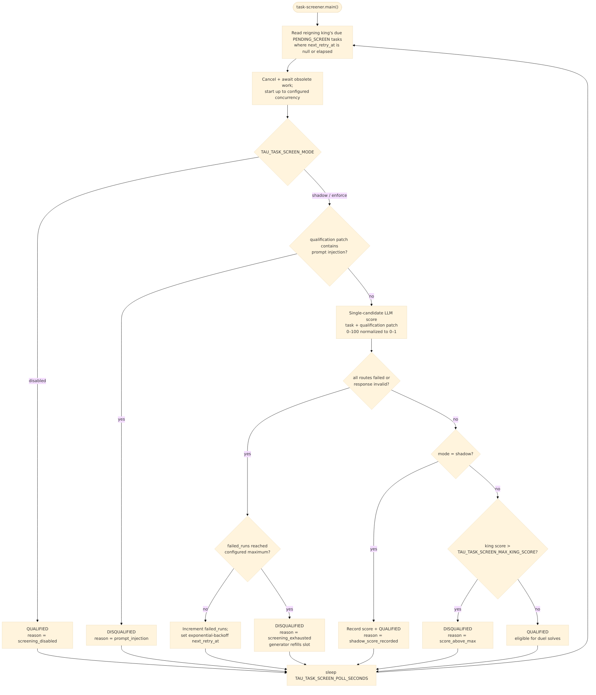 | 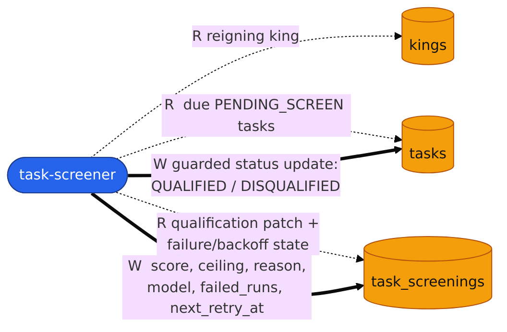 |

- In `enforce` mode, a normalized score strictly greater than
  `TAU_TASK_SCREEN_MAX_KING_SCORE` disqualifies the task; equality or a lower
  score qualifies it. `shadow` records the same decision inputs but admits both
  sides of the boundary. `disabled` skips the LLM and qualifies pending tasks,
  so task-screening tests and local screening runs need no OpenRouter key.
- Prompt injection is an explicit terminal disqualification reason in active
  screening modes, independent of the numeric ceiling.
- A model, transport, timeout, or parse failure records telemetry and schedules
  an exponential-backoff retry. After `TAU_TASK_SCREEN_MAX_FAILED_RUNS`, it
  terminally disqualifies the task as `screening_exhausted`; the generator then
  fills the pool deficit. There is no neutral-score fallback, and one
  permanently unscreenable task cannot hold a full-pool duel open forever.
- Primary and fallback routes are interleaved by attempt round, so a hanging
  primary cannot consume every retry before a fallback is tried. The per-call
  and total time budgets deliberately match the production duel judge.
- Guarded writes require the same king and `PENDING_SCREEN` state, so a late score
  cannot affect a stale pool after the king changes.

### 7.6 judge

Compares the king's and challenger's solution for each QUALIFIED task in an
active challenge, producing one `judgements` row per pair. Every comparison is
**blinded**: a per-pair hash decides whether the king is "candidate A" or "B",
so the LLM never learns which patch belongs to whom. Patches are also scanned for
**prompt injection**; a detected attempt is scored deterministically instead of
being sent to the model.

| Loop | Database |
|------|----------|
| 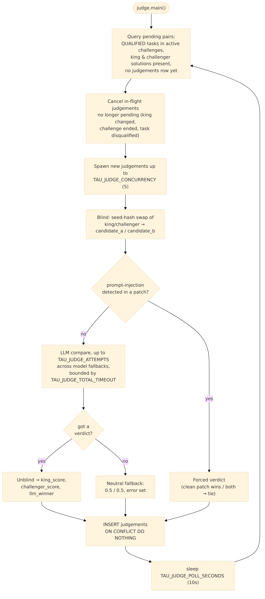 | 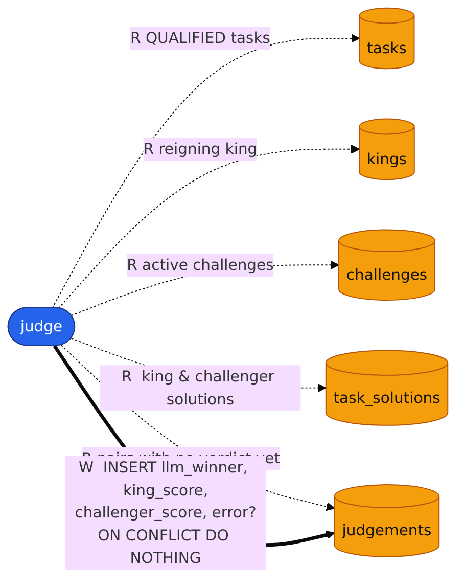 |

- **Writes:** `judgements` (`llm_winner`, `king_score`, `challenger_score`,
  plus telemetry), `ON CONFLICT DO NOTHING` (first verdict wins).
- **The `error` column is meaningful:** if all model attempts fail or time out,
  the judge writes a **neutral error verdict** (`0.5 / 0.5`, winner `tie`) with
  `error` set — that is *not* a tie the model actually decided.
- Retries the configured judge model up to `TAU_JUDGE_ATTEMPTS`, bounded by
  `TAU_JUDGE_TOTAL_TIMEOUT`.

### 7.7 duel-resolver

The arbiter and the **sole writer of `challenges` and `kings`** — **run exactly
one instance** (never scale it). Each tick it takes one consistent snapshot of
the arena, runs a pure decision function, and applies at most one guarded state
transition. Guarded writes (conditioned on the pool it observed) make it safe
against races even though it never holds locks across ticks.

| Loop | Database |
|------|----------|
| 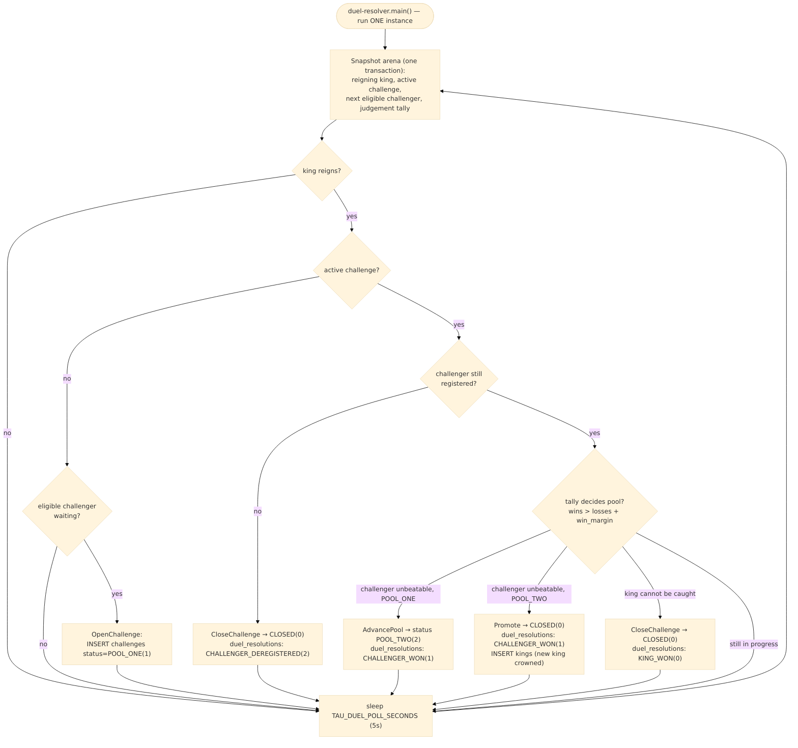 | 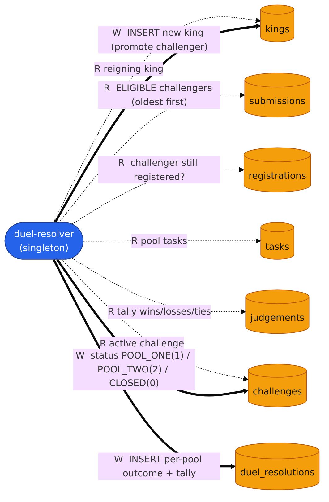 |

- **Opens** a challenge for the oldest `ELIGIBLE`, still-registered submission:
  `INSERT challenges status = POOL_ONE (1)`.
- **Advances / promotes / closes** by updating `challenges.status` to
  `POOL_TWO (2)` or `CLOSED (0)`, and appending a `duel_resolutions` row that
  snapshots the tally, raw quality, token boosts, merged scores, token totals,
  configured margins, and `outcome`.
- **Crowns** a new king on a POOL_TWO win by inserting into `kings`
  (`ON CONFLICT DO NOTHING`).
- **Drains safely:** `SIGUSR1` lets the active duel finish but blocks the next
  challenge; `SIGUSR2` resumes opening challenges.
- In mean mode, token efficiency modifies both sides symmetrically. On each task,
  a side can earn `1 - its tokens / the other side's tokens` when its score is at
  least the configured minimum and within the configured tolerance. The average
  saving over the full pool is multiplied by the bonus multiplier and added to
  that side's raw mean. The one final margin gate compares the merged scores.

### 7.8 weight-setter

The **sole setter of on-chain weights** — **run exactly one instance** (never
scale it). It signs the `set_weights` extrinsic with a mounted Bittensor wallet
hotkey, so it is the only worker besides chain-watcher that touches the chain.

| Loop | Database |
|------|----------|
| gate on epoch + rate limit → compute → submit | reads the recent-king window from `kings`/`registrations` |

- **Emission split (the rolling king window).** With all five slots filled:
  40% to the reigning king and 15% to each of the four prior kings. While fewer
  than five distinct kings have reigned, a bootstrap table splits 100% among the
  ones that exist (e.g. two kings → 60/40, three → 40/30/30). Emission follows
  the **hotkey**, and a king that has since deregistered is skipped.
- **Burn.** Any unfilled or ineligible share burns to `TAU_WEIGHT_BURN_UID`
  (uid 0 by convention). `TAU_WEIGHT_BURN_MODE=true` emits 100% to the burn uid
  regardless of king history — a deliberate, restart-toggled kill switch.
- **Cadence.** Level-triggered: each tick it checks the chain's weight-set rate
  limit and the epoch boundary, and only submits within `TAU_WEIGHT_SET_MARGIN`
  blocks of the boundary — landing the vector as late as possible (capturing the
  latest king) while leaving time for inclusion.

### 7.9 dashboard

A small, DB-backed HTTP service (`tau-dashboard-api`) that serves the public
read model for **ninja66.ai** as JSON under `/api/dashboard/*`. It is read-only
and deliberately **leaks nothing sensitive**: no task prompts, solution diffs,
judge rationales, filesystem paths, or raw submission bundles — only aggregate
tournament state (current king, recent duels, standings, emission shares).

It listens on `TAU_DASHBOARD_PORT` (8066) and in production sits behind the
nginx config in [deploy/nginx/ninja66.conf](deploy/nginx/ninja66.conf), which
terminates TLS and reverse-proxies the API.

### 7.10 benchmark-worker (optional)

An **objective** counterpart to the blinded judge ladder. It watches the `kings`
table and, for each new king, runs that king's real `agent.py` against
**SWE-bench Pro**, scoring test-resolution rate and cost with the official Scale
evaluator and writing a per-king result folder. It is restart-safe: an on-disk
`benchmark.json` marker plus the suite's per-instance resume means an interrupted
run continues where it left off.

Unlike the other workers it is **not a self-contained image**: it shells out to a
separate benchmark suite checkout (`TAU_BENCH_REPO_DIR`) and drives
docker-out-of-docker to run multi-GB images, so it is run on the host rather than
via compose. See
[src/tau/workers/benchmark/README.md](src/tau/workers/benchmark/README.md) for
the full setup and the commented `benchmark-worker` block in `compose.yaml`.

---

## 8. Agent execution environment (sandboxing)

The agent must be able to call an LLM to solve a task, but must **not** be able to:
reach the internet, read the validator's real LLM API key, spend without bound,
or influence the host. This is enforced by task-solver sandbox.

### Architecture

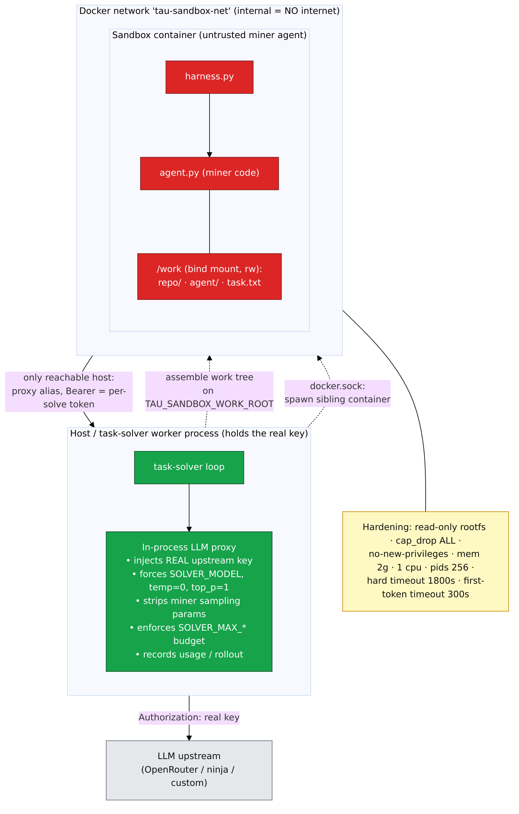

The building blocks:

- **Docker-out-of-docker.** The task-solver mounts the host `/var/run/docker.sock`
  and spawns **sibling** sandbox containers on the host daemon (not nested).
- **Internet-less network.** Sandboxes attach to a Docker network created with
  `internal: true` — **no default gateway, no internet**. The only host the
  agent can reach is the validator's in-process LLM proxy (via a fixed alias).
- **The in-process proxy is the only exit.** The agent is given a proxy URL and a
  **per-solve bearer token** (not the real key). The proxy authenticates that
  token, then forwards the request to the real upstream with the **real key
  injected server-side** — the key never enters the container. The proxy also:
  - **forces the model** (`SOLVER_MODEL`) and locks sampling params
    (`temperature=0`, `top_p=1`, plus a stable validator-owned `seed` derived
    from the task id), stripping miner-supplied params like `seed`, `top_k`,
    `logit_bias`;
  - **enforces per-solve spend caps** (`SOLVER_MAX_*`), clamping `max_tokens`
    and rejecting requests that would exceed a budget;
  - **records usage / rollouts** (redacting secrets).
- **Locked-down container.** Read-only rootfs, `cap_drop: ALL`,
  `no-new-privileges`, no swap, and limits on memory (2g), CPU (1.0), PIDs (256),
  and file descriptors. Only `/work` (the bind-mounted task tree) and `/tmp` are
  writable (tmpfs). Runs as the worker's own UID so it owns the mount without
  extra capabilities.
- **Watchdog timeouts.** A hard wall-clock cap (`600s`) and a first-token
  timeout (`300s`) kill a stuck or stalling agent.
- **Clean work tree.** The task repo is cloned at the parent commit and its git
  credentials are scrubbed before the tree is exposed to the sandbox.

### One solve, end to end

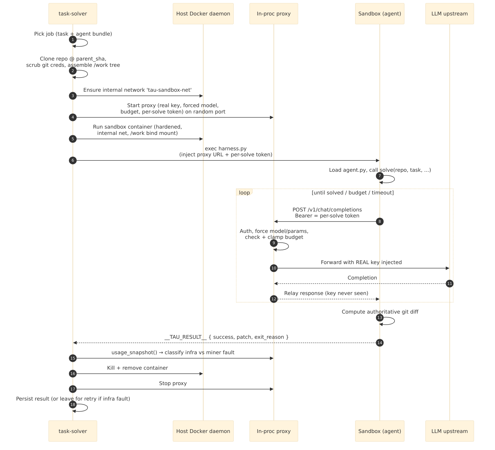

After the agent exits, the harness computes the **authoritative git diff** of the
work tree (so an agent that edits files but returns no patch is still scored on
what it changed). The solver then inspects the proxy's usage snapshot to classify
the outcome as a retryable infra fault or a terminal result.

### Security properties

| Property | Mechanism |
|----------|-----------|
| No internet egress | `internal` Docker network — no gateway. |
| Real key never in sandbox | Key held by the worker; injected by the proxy on the upstream call only. |
| Model & params locked | Proxy overwrites `model`, forces `temperature`/`top_p`, strips miner params. |
| Bounded spend | Proxy enforces `SOLVER_MAX_*` per solve; clamps tokens-per-request. |
| No host harm | Read-only rootfs, dropped caps, no-new-privileges, resource limits. |
| No runaway agents | Hard timeout + first-token timeout watchdog. |
| Infra faults not blamed on miners | Upstream 401/402/403/408/429/5xx & transport errors are retried, not persisted. |

Everything here is configured via `TAU_SANDBOX_*`, `SOLVER_*`, and
`TAU_PROXY_*` env vars — see [§11](#11-configuration-reference).

---

## 9. Information for miners

A **submission** is an agent bundle. On the validator it lives at:

```
$TAU_SUBMISSIONS_DIR/<submission_id>/agent.py       # entry point (required)
$TAU_SUBMISSIONS_DIR/<submission_id>/agent/...       # optional supporting package
```

### The agent contract

Your `agent.py` must define a single function:

```python
def solve(repo_path, issue, model, api_base, api_key) -> dict:
    """
    repo_path : path to the checked-out repo at the parent commit — EDIT FILES HERE
    issue     : the natural-language problem statement (task.txt)
    model     : the model slug you must pass to the LLM (the proxy enforces it)
    api_base  : the LLM proxy base URL   (OpenAI-compatible; your ONLY network exit)
    api_key   : a per-solve token for the proxy (NOT the real upstream key)

    Return at least {"success": bool}. Optionally {"patch": "<unified diff>"}.
    """
```

What matters:

- **The git diff is authoritative.** The harness runs `git diff` (tracked +
  untracked) over `repo_path` after you return. Just edit files in place — you do
  not need to construct a patch yourself. A returned `patch` is only used as a
  fallback if the tree is otherwise unchanged.
- **Call the model through `api_base`/`api_key` only.** There is no internet.
  The sandbox image ships `openai`, `httpx`, and `mini-swe-agent`; anything else
  your agent needs must be **vendored** into your bundle (no `pip install` at
  runtime). See [examples/task_solver/agents/swe_agent.py](examples/task_solver/agents/swe_agent.py)
  for the minimal real-LLM pattern and
  [noop_agent.py](examples/task_solver/agents/noop_agent.py) for a token-free one.
- **You are on a spend budget.** The proxy may cap requests, tokens, and cost per
  solve (`SOLVER_MAX_*`) and forces `model` + deterministic sampling. Requests
  over budget are rejected; blowing the budget ends your solve.
- **Respect the timeouts.** A solve has a hard wall-clock limit and a
  first-token limit; a hung agent is killed and scored on whatever it produced.
- **Qualification uses the king's agent, not yours.** Tasks you're judged on were
  already solved by the current king, so they are known-solvable.
- **Don't try to game the judge.** Comparisons are blinded and patches are
  scanned for prompt-injection; an injection attempt is scored against you.
- **How you win:** produce patches that an LLM judge prefers over the king's,
  consistently enough to clear both pools (`wins > losses + win_margin`).

---

## 10. Deployment manual

### Prerequisites

- Docker + Docker Compose.
- A host that can run the Postgres container and the workers. The **task-solver**
  needs access to the host Docker daemon (it spawns sandbox containers).
- Credentials: an OpenRouter key for task generation, submission qualification,
  and task screening in `shadow`/`enforce` mode, plus GitHub token(s) for commit
  mining. `TAU_TASK_SCREEN_MODE=disabled` means the screener itself no longer
  forces that key; generator/judge dummy modes are independently token-free. The
  default solver proxy still needs its configured upstream credential.
- A **Bittensor wallet** for the weight-setter: its hotkey signs the
  `set_weights` extrinsic. The wallet directory is mounted read-only (see
  `HOST_BITTENSOR_WALLETS` and `BITTENSOR_WALLET_NAME`/`_HOTKEY`). The
  chain-watcher only reads the chain and needs no wallet.

### Steps

```bash
# 1. Configure
cp .env.example .env
#   Edit .env — at minimum change:
#     POSTGRES_PASSWORD, MONITOR_PASSWORD      (secrets)
#     OPENROUTER_API_KEY                       (unless using dummy LLMs)
#     GITHUB_TOKEN or GITHUB_TOKENS            (commit mining)
#     TAU_SUBMISSIONS_DIR, TAU_SANDBOX_WORK_ROOT
#     SOLVER_MAX_* spend caps                  (strongly recommended)

# 2. Bring up the whole stack
docker compose up -d

# 3. Watch it converge
docker compose logs -f
docker compose logs migrate     # confirm "alembic upgrade head" succeeded
```

### What happens on first boot

1. **db** starts, initializes the cluster, and runs
   [deploy/db/00_init.sh](deploy/db/00_init.sh) once as superuser: creates the
   `pgcrypto`, `pg_stat_statements`, and `pg_trgm` extensions, sets database
   GUCs (`timezone=UTC`, `statement_timeout=60s`,
   `idle_in_transaction_session_timeout=60s`, `lock_timeout=10s`), and creates a
   read-only **`monitor`** role.
2. **migrate** waits for the DB to be healthy, runs `alembic upgrade head` (all
   tables, indexes, and the three views — idempotent, safe to re-run), then
   exits.
3. Every worker starts once the DB is healthy **and** migrate has completed
   successfully (`depends_on` gates this).

### Operational notes

- **Two singletons.** The **duel-resolver** is the sole writer of
  `challenges`/`kings` and the **weight-setter** is the sole setter of on-chain
  weights — never `--scale` either. Others (judge, task-solver, qualification)
  can scale.
- **Public dashboard.** The `dashboard` service publishes the API on
  `127.0.0.1:${TAU_DASHBOARD_HOST_PORT:-8066}`; put nginx
  ([deploy/nginx/ninja66.conf](deploy/nginx/ninja66.conf)) in front of it for
  public TLS. Skip the service if you don't need the public site.
- **Pause between duels for maintenance:** send `SIGUSR1`, then wait for
  `idle: new_challenges_paused` before stopping or rebuilding services. The
  active duel continues normally. Send `SIGUSR2` to cancel the pause:
  ```bash
  docker compose kill -s SIGUSR1 duel-resolver
  docker compose logs -f duel-resolver
  docker compose kill -s SIGUSR2 duel-resolver
  ```
  The pause lives in the running resolver, so after rebuilding, start the
  resolver last when the rest of the stack is ready.
- **Existing-validator rollout:** the screening migration is schema-only; it does
  not delete or retroactively rescore live tasks. To rebuild cleanly, stop the
  pool/duel workers and reset the reigning king's tasks at a challenge boundary.
  If a challenge is active, reset it in the same operator-approved transaction so
  old pool resolutions cannot survive while their task judgements cascade away.
  Start generator, solver, and task-screener in the default `shadow` mode first;
  resume judge/duel-resolver only after both pools reach their configured count of
  `QUALIFIED` tasks. Calibrate the score distribution before changing
  `TAU_TASK_SCREEN_MODE=enforce`; that mode change applies only to newly screened
  tasks unless the pool is deliberately rebuilt again.
- **task-solver requirements:** it mounts `/var/run/docker.sock`, mounts
  `TAU_SUBMISSIONS_DIR` read-only, and mounts `TAU_SANDBOX_WORK_ROOT` at the
  **same path on host and in the container**. That same-path rule is mandatory:
  the sandbox's `/work` bind-mount is resolved by the *host* daemon, so the path
  must mean the same thing on both sides.
- **duel-resolver promotion:** compose also mounts `TAU_SUBMISSIONS_DIR`
  read-only into the singleton resolver so it can publish a promoted king's
  bundle when `TAU_PROMOTION_PUBLISH_REPO` and a GitHub token are configured.
- **Run a single worker on the host** (outside compose) for debugging:
  ```bash
  export DATABASE_URL="postgresql+psycopg://appuser:<pw>@localhost:5432/arena"
  uv sync --extra task-solver --locked
  uv run task-solver      # or: task-generator | task-screener | judge-worker |
                          #     duel-resolver | chain-watcher | qualification-worker |
                          #     weight-setter | tau-dashboard-api | benchmark-worker
  ```
- **Postgres** runs with a tuned [postgresql.conf](deploy/db/postgresql.conf) and
  `shm_size: 1gb`. The db service is capped at 4 CPU / 8 GB — keep those ≥ what the conf implies.
- **Monitoring:** connect the read-only role with
  `psql "postgresql://monitor:<MONITOR_PASSWORD>@localhost:5432/arena"`.
- **Prune disabled solver endpoints from `.env`:** the solver writes flaky
  endpoints to `TAU_SOLVER_DISABLED_UPSTREAMS_FILE`. To intentionally reflect
  that state back into your comma-separated upstream list, run:
  ```bash
  uv run tau-prune-disabled-upstreams .env
  docker compose up -d --force-recreate task-solver
  ```

### Adding a new migration

Edit [src/tau/db/models.py](src/tau/db/models.py), then from the migrate context
generate and apply:

```bash
# with DATABASE_URL set, from deploy/migrate/
alembic revision --autogenerate -m "describe change"
docker compose up migrate
```

---

## 11. Configuration reference

Everything is set through `.env` (see [.env.example](.env.example) for the
authoritative, commented list). Grouped by concern:

### Database

| Var | Default | Effect |
|-----|---------|--------|
| `POSTGRES_USER` | `appuser` | Role created on first init; part of `DATABASE_URL`. |
| `POSTGRES_PASSWORD` | — | **Change it.** DB password. |
| `POSTGRES_DB` | `arena` | Database name. |
| `POSTGRES_PORT` | `5432` | Published port. |
| `MONITOR_PASSWORD` | — | Password for the read-only `monitor` role. |
| `DATABASE_URL` | computed | Overridden per-worker to the compose `db` host; set manually only for host-side runs. |

### Chain / Bittensor (chain-watcher)

| Var | Default | Effect |
|-----|---------|--------|
| `BITTENSOR_NETWORK` | `finney` | Lite node / network for the metagraph and tip. |
| `BITTENSOR_ARCHIVE_NETWORK` | `archive` | Archive node for historical registration block times. |
| `NETUID` | `66` | Subnet to watch. |
| `POLL_INTERVAL_SECONDS` | `6` | Seconds between chain polls. |
| `LOG_LEVEL` | `INFO` | Logging verbosity (all workers). |

### GitHub (task-generator; also task-solver repo clones)

| Var | Default | Effect |
|-----|---------|--------|
| `GITHUB_TOKEN` | — | Single token (fallback if `GITHUB_TOKENS` unset). |
| `GITHUB_TOKENS` | — | Comma-separated token pool, rotated round-robin with per-token cooldowns. |

### LLM upstream (OpenRouter / task-solver proxy)

| Var | Default | Effect |
|-----|---------|--------|
| `OPENROUTER_API_KEY` | unset | Key for task generation, task screening in `shadow`/`enforce` mode, duel judging, and the default solver proxy upstream. |
| `LLM_PROVIDER` | `openrouter` | Solver proxy upstream: `openrouter` \| `ninja` \| `custom`. |
| `OPENROUTER_UPSTREAM_BASE_URL` | `https://openrouter.ai/api` | Override OpenRouter endpoint. |
| `OPENROUTER_UPSTREAM_BASE_URLS` | unset | Optional comma-separated solver proxy endpoints; sandbox solves use smart sticky routing by default. |
| `NINJA_INFERENCE_BASE_URL` / `NINJA_INFERENCE_API_KEY` | unset | Used when `LLM_PROVIDER=ninja`. |
| `NINJA_INFERENCE_BASE_URLS` | unset | Optional comma-separated local inference endpoints, e.g. `<solver-host>:8000/v1,<solver-host>:8001/v1`; sandbox solves use smart sticky routing by default. |
| `LLM_UPSTREAM_BASE_URL` / `LLM_UPSTREAM_API_KEY` | unset | Used when `LLM_PROVIDER=custom` (any OpenAI-compatible endpoint). |
| `LLM_UPSTREAM_BASE_URLS` | unset | Optional comma-separated custom endpoints, e.g. `<solver-host>:8000/v1,<solver-host>:8001/v1`; sandbox solves use smart sticky routing by default. |
| `TAU_SOLVER_SMART_CACHE_ROUTING` | `true` | Keep each sandbox solve on one upstream endpoint and reuse prompt-prefix affinity across solves; set false for per-request round-robin. |
| `TAU_SOLVER_DISABLED_UPSTREAMS_FILE` | unset code fallback; `/var/lib/tau/sandbox-work/disabled-upstreams.txt` in `.env.example` | Optional newline-delimited disabled endpoint file. When set, endpoints that reach the max 240s cooldown are written here and avoided permanently; remove the URL from this file and restart the solver to re-enable it. Run `uv run tau-prune-disabled-upstreams .env` to deliberately prune disabled URLs from comma-separated upstream lists. Automatic disable keeps at least one configured endpoint available. |

### qualification (submission security gate)

| Var | Default | Effect |
|-----|---------|--------|
| `OPENROUTER_API_KEY` | required | Key for the security-review LLM. |
| `TAU_QUALIFICATION_WINDOW_SIZE` | `3` | How many most-recent, still-registered submissions the gate keeps at the queue head. |
| `TAU_QUALIFICATION_BASE_PATH` | unset | Public base agent harness to diff submissions against; unset → degraded mode (`base_files_available=false`). |
| `TAU_QUALIFICATION_POLL_SECONDS` | `10` | Idle poll interval. |
| `TAU_QUALIFICATION_LLM_TIMEOUT` | `120` | Per-review LLM timeout (s). |
| `TAU_QUALIFICATION_MAX_TOKENS` | `16000` | Output cap per review call. |
| `TAU_SECURITY_QUALIFICATION_MODEL` | `google/gemini-3.1-flash-lite` | Review model. |
| `TAU_SECURITY_QUALIFICATION_*_MAX_CHARS` | see config | Per-section truncation caps for the reviewed patch/files. |

### task-generator tuning

| Var | Default | Effect |
|-----|---------|--------|
| `TAU_GENERATOR_MODEL` | `deepseek/deepseek-v4-pro` | Model that writes task descriptions. |
| `TAU_GENERATOR_DESCRIBE_CONCURRENCY` | `5` | Concurrent describer coroutines. |
| `TAU_GENERATOR_LLM_ATTEMPTS` | `2` | LLM tries per commit before abandoning it. |
| `TAU_GENERATOR_LLM_TIMEOUT` | `120` | Per-attempt LLM timeout (s). |
| `TAU_GENERATOR_POLL_SECONDS` | `30` | Idle poll interval. |
| `TAU_GENERATOR_QUALIFICATION_INFLIGHT_TARGET` | `100` | Real candidate/screening tasks maintained across incomplete pools so qualification solve fan-out remains production-shaped near the final slots. |
| `TAU_GENERATOR_USE_DUMMY_LLM` + `TAU_GENERATOR_DUMMY_*` | off | Token-free fabricated descriptions for testing (see `.env.example`). |

### task-screener tuning

| Var | Default | Effect |
|-----|---------|--------|
| `TAU_TASK_SCREEN_MODE` | `shadow` | `shadow` records scores but admits tasks; `enforce` applies the ceiling; `disabled` admits without an LLM/key. |
| `TAU_TASK_SCREEN_MAX_KING_SCORE` | `0.70` | In enforce mode, disqualify when the normalized king score is strictly greater than this ceiling. |
| `TAU_JUDGE_*` | see below | Screening shares the production duel judge's model, providers, reasoning, attempts, timeouts, and token cap. |
| `TAU_TASK_SCREEN_CONCURRENCY` | `5` | Task scores in flight. |
| `TAU_TASK_SCREEN_POLL_SECONDS` | `10` | Idle poll interval. |
| `TAU_TASK_SCREEN_MAX_FAILED_RUNS` | `3` | Failed runs before terminal `screening_exhausted` disqualification and pool refill. |
| `TAU_TASK_SCREEN_RETRY_BASE_SECONDS` | `60` | Initial exponential-backoff delay after a failed run (s). |
| `TAU_TASK_SCREEN_RETRY_MAX_SECONDS` | `900` | Maximum retry-backoff delay (s). |

### judge tuning

| Var | Default | Effect |
|-----|---------|--------|
| `TAU_JUDGE_MODEL` | `z-ai/glm-5.2` | Primary judge model. |
| `TAU_JUDGE_PROVIDER_ONLY` | `z-ai/fp8` | OpenRouter endpoint/provider allowlist for the primary judge model. |
| `TAU_JUDGE_PROVIDER_ALLOW_FALLBACKS` | `false` | Disable OpenRouter provider fallback for the primary judge model. |
| `TAU_JUDGE_FALLBACK_MODELS` | `z-ai/glm-5.2` | Comma-separated fallback judge models tried after the primary route. |
| `TAU_JUDGE_FALLBACK_PROVIDER_ONLY` | `atlas-cloud/fp8` | OpenRouter provider allowlist for fallback judge models. |
| `TAU_JUDGE_FALLBACK_PROVIDER_ALLOW_FALLBACKS` | `false` | Disable OpenRouter provider fallback for the fallback route. |
| `TAU_JUDGE_MAX_TOKENS` | `32000` | Output cap per judge LLM call. |
| `TAU_JUDGE_CONCURRENCY` | `5` | Judgements in flight. |
| `TAU_JUDGE_ATTEMPTS` | `4` | LLM tries per round. |
| `TAU_JUDGE_LLM_TIMEOUT` | `120` | Per-attempt timeout (s). |
| `TAU_JUDGE_TOTAL_TIMEOUT` | `300` | Cap on one pair's total judging time (s). |
| `TAU_JUDGE_POLL_SECONDS` | `10` | Idle poll interval. |
| `TAU_JUDGE_USE_DUMMY_LLM` + `TAU_JUDGE_DUMMY_*` | off | Token-free random verdicts for testing. |

### Pool targets & duel resolution

| Var | Default | Effect |
|-----|---------|--------|
| `TAU_POOL_ONE_TARGET` | `50` | Tasks to maintain in pool 1 for the king. |
| `TAU_POOL_TWO_TARGET` | `50` | Tasks to maintain in pool 2 for the king. |
| `TAU_DUEL_SCORING_METHOD` | `round_wins` code fallback; `mean` in `.env.example` | Resolve each completed pool by round wins or mean score. |
| `TAU_DUEL_ROUND_WIN_MARGIN` | `0` | Extra margin in the rule `wins > losses + margin`. |
| `TAU_DUEL_MEAN_SCORE_MARGIN` | `0.10` | In mean mode, the challenger's merged score must exceed the king's merged score by this amount. |
| `TAU_DUEL_TOKEN_BONUS_ENABLED` | `false` code fallback; `true` in `.env.example` | Enable the symmetric per-task token modifier in mean mode. |
| `TAU_DUEL_TOKEN_SCORE_TOLERANCE` | `0.05` | A side can earn a task saving when its quality is no more than this far behind. |
| `TAU_DUEL_TOKEN_MIN_SCORE` | `0.20` | Minimum task quality required before token savings may help that side. |
| `TAU_DUEL_TOKEN_BONUS_MULTIPLIER` | `0.15` | Multiply the full-pool average token saving by this amount before adding it to quality. |
| `TAU_DUEL_POLL_SECONDS` | `5` | duel-resolver poll interval. |
| `TAU_PROMOTION_PUBLISH_REPO` | unset | Optional GitHub repository that receives a promoted king's bundle. |
| `TAU_PROMOTION_PUBLISH_BRANCH` | `main` | Branch used for optional king publication. |
| `TAU_PROMOTION_GITHUB_TOKEN` | legacy token fallback | Token used for optional king publication. |
| `TAU_PROMOTION_PUBLISH_REQUIRED` | `false` | If true, do not crown the challenger unless publication succeeds. |

### weight-setter (on-chain emission)

| Var | Default | Effect |
|-----|---------|--------|
| `BITTENSOR_WALLET_NAME` | required | Coldkey wallet name that signs `set_weights`. |
| `BITTENSOR_WALLET_HOTKEY` | required | Hotkey used to sign. |
| `BITTENSOR_WALLET_PATH` | `~/.bittensor/wallets` | Wallet dir inside the container (compose mounts `HOST_BITTENSOR_WALLETS` here read-only). |
| `HOST_BITTENSOR_WALLETS` | `${HOME}/.bittensor/wallets` | Host wallet dir mounted into the weight-setter. |
| `TAU_WEIGHT_WINDOW` | `5` | Number of recent kings that share emission. |
| `TAU_WEIGHT_BURN_UID` | `0` | uid that unfilled/ineligible shares burn to. |
| `TAU_WEIGHT_BURN_MODE` | `false` | Emit 100% to the burn uid, ignoring king history (kill switch). |
| `TAU_WEIGHT_SET_MARGIN` | `12` | Submit within this many blocks of the epoch boundary. |
| `TAU_WEIGHT_POLL_SECONDS` | `12` | Idle poll interval (~one block). |

### dashboard (public API)

| Var | Default | Effect |
|-----|---------|--------|
| `TAU_DASHBOARD_HOST` | `0.0.0.0` (compose) | Bind address. |
| `TAU_DASHBOARD_PORT` | `8066` | In-container listen port. |
| `TAU_DASHBOARD_HOST_PORT` | `8066` | Host port published on `127.0.0.1`. |
| `TAU_DASHBOARD_RECENT_DUELS` | see config | How many recent duels the read model returns. |
| `TAU_DASHBOARD_FRESH_SECONDS` | see config | Cache/freshness window for computed payloads. |

### task-solver & proxy

| Var | Default | Effect |
|-----|---------|--------|
| `SOLVER_MODEL` | required | Model the proxy forces every agent request onto. Set it in `.env`. |
| `MAX_CONTAINERS` | `4` code fallback; `100` in `.env.example` | Max concurrently running qualification and duel sandboxes. Size this to host and upstream capacity. |
| `TAU_SOLVER_POLL_SECONDS` | `30` | Idle poll interval; while work is running, free slots are refilled about once per second. |
| `TAU_SOLVER_QUALIFY_MIN_CHANGED_LINES` | `1` | Min diff lines the king must change before a task advances to screening. |
| `TAU_SOLVER_REQUIRE_FULL_POOL_FOR_DUELS` | `false` code fallback; `true` in `.env.example` | Additional active-pool safety gate before scheduling duel solves. New challenges always wait for both pools to reach their QUALIFIED targets. |
| `TAU_SUBMISSIONS_DIR` | `submissions` | Host dir of extracted submissions (mounted read-only, same path). |
| `TAU_SANDBOX_WORK_ROOT` | system temp | Host dir for per-solve work trees (**same path host↔container**). |
| `SOLVER_MAX_REQUESTS` / `_TOTAL_TOKENS` / `_COST` / `_TOKENS_PER_REQUEST` | unbounded | Per-solve spend caps. **Strongly advised** — untrusted code drives the spend. |
| `TAU_PROXY_REQUEST_TIMEOUT_SECONDS` | `600` | Upstream read timeout; a timeout is a retryable infra fault. |

### Sandbox hardening (`TAU_SANDBOX_*`)

| Var | Default | Effect |
|-----|---------|--------|
| `TAU_SANDBOX_MEMORY` | `2g` | Memory limit (swap pinned equal → no swap). |
| `TAU_SANDBOX_CPUS` | `1.0` | CPU limit. |
| `TAU_SANDBOX_PIDS_LIMIT` | `256` | Max processes. |
| `TAU_SANDBOX_NOFILE_LIMIT` | `4096` | File-descriptor ulimit. |
| `TAU_SANDBOX_HARD_TIMEOUT_SECONDS` | `600` | Absolute wall-clock cap per solve. |
| `TAU_SANDBOX_FIRST_TOKEN_TIMEOUT_SECONDS` | `300` | Kill if the model never responds. |
| `TAU_SANDBOX_DROP_CAPS` / `_NO_NEW_PRIVILEGES` / `_READ_ONLY_ROOTFS` | `true` | Container hardening toggles. |
| `TAU_SANDBOX_WORK_TMPFS_SIZE` / `_TMP_TMPFS_SIZE` | `1g` / `512m` | Writable tmpfs sizes. |
| `TAU_SANDBOX_IMAGE_NAME` / `_NO_CACHE` / `_CONTAINER_TTL_SECONDS` / `_USER` | see config | Image name / rebuild / TTL / run-as user. |

### Observability (optional)

| Var | Default | Effect |
|-----|---------|--------|
| `AXIOM_TOKEN` / `AXIOM_DATASET` / `AXIOM_ENVIRON` | unset | Send structured solver events to Axiom.co (no-op unless all three set and `axiom-py` installed). |

---

## 12. Post-deployment tuning

**Takes effect on restart, no rebuild.** Almost all tuning knobs are read at
worker startup. Edit `.env`, then recreate the affected service:

```bash
docker compose up -d --force-recreate task-solver     # one service
docker compose up -d --force-recreate                  # all
```

This covers every `TAU_*`, `SOLVER_*`, model, poll-interval, pool-target,
spend-cap, sandbox-hardening, and `AXIOM_*` variable, plus `LLM_PROVIDER` and
chain settings.

**Requires a rebuild** (`docker compose build <service>`): the image build args
`EXTRA`, `WORKER`, and `INSTALL_GIT` — i.e. adding a worker or changing its
dependency set.

**Do not change on a live database:** `POSTGRES_USER` / `POSTGRES_PASSWORD` /
`POSTGRES_DB` (they only apply on first init; changing them later needs a manual
migration). `TAU_SUBMISSIONS_DIR` / `TAU_SANDBOX_WORK_ROOT` must stay in sync
with the compose mounts if changed.

---

## 13. Local development

- **Dry-run the solver end-to-end** — [examples/task_solver/README.md](examples/task_solver/README.md).
  Use [seed_duel.py](examples/task_solver/seed_duel.py) to crown a king and set
  up challengers (`--scaffold` creates token-free dummy agents), run the
  `task-solver`, then inspect with [show_state.py](examples/task_solver/show_state.py).
- **Solve a single task in isolation** (no DB, no worker loop) —
  [scripts/solve_one.py](scripts/solve_one.py): mine or reuse a task, run one
  agent in the sandbox, print the result/diff (`--trace` streams the LLM calls).
- **Inspect the commit sampler** — [scripts/sample_commit.py](scripts/sample_commit.py)
  (`--json`, `--patch`, `--seed`).
- **Check GitHub token quota** — [scripts/check_github_quota.py](scripts/check_github_quota.py).
- **Tests:** `uv run pytest`. Postgres-gated tests use a **separate**
  `TAU_TEST_DATABASE_URL` database that is dropped/recreated around each test —
  never point it at real data.

---

## 14. Repository layout

```
src/tau/
  workers/            # worker entrypoints (main() + loop/pipeline)
    chain_watcher.py
    qualification/   task_generator/  task_solver/  task_screener/
    judge/  duel_resolver/  weight_setter/  benchmark/
  db/                 # SQLAlchemy models, status enums, per-worker DB seams
  bittensor/          # chain source/sink (metagraph, registrations)
  github/             # commit sampler, token rotation, client
  taskgen/            # commit → problem-statement description + fingerprint
  qualification/      # submission security-review prompt, policy, scoring
  task_screening/     # single-candidate difficulty prompt, parser, and scorer
  judging/            # blinding, prompt, parsing, injection safety
  duel/               # pure decision logic (decide/predicates/snapshot/actions)
  weights/            # emission split across the rolling king window + cadence
  sandbox/            # docker-out-of-docker runner, network, harness, hardening
  proxy/              # in-process LLM proxy: budget, upstream, cache, rollout
  openrouter/         # shared OpenRouter LLM client
  dashboard/          # public read-only JSON API (ninja66.ai)
  axiom/  utils/      # optional Axiom telemetry; env/logging helpers
  pools.py            # pool targets
deploy/               # db init + tuning, migrations, worker Dockerfile, nginx
examples/task_solver/ # local dry-run harness + sample agents
scripts/              # one-off tools (solve_one, sample_commit, quota)
docs/diagrams/        # diagram sources (.mmd) + rendered .png
compose.yaml          # the full stack
```

---

## 15. Regenerating the diagrams

All diagrams are authored as Mermaid sources in
[docs/diagrams/](docs/diagrams/) (`*.mmd`) and rendered to `*.png`. To
re-render after editing a source (needs only Docker — no local Node/Chromium):

```bash
cd docs/diagrams
./render.sh                 # render every *.mmd
./render.sh system-overview.mmd   # or a single file
```

The script uses the `minlag/mermaid-cli` image with the pinned
[puppeteer-config.json](docs/diagrams/puppeteer-config.json). Keep the `.mmd`
sources as the source of truth and commit the regenerated `.png` alongside.
